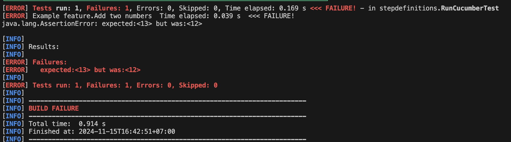
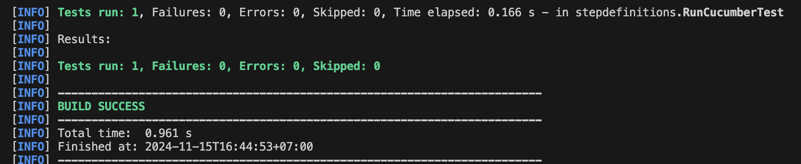

### Init maven project
`mvn archetype:generate -DgroupId=com.example -DartifactId=cucumber-example -DarchetypeArtifactId=maven-archetype-quickstart -DinteractiveMode=false`

### Run
`maven test`

### Example output
Failure

Success

